###  A review of the Vancouver's air bnb data-UDacity-CrispDM Project

#### BUSINESS UNDERSTANDING

The data sets obtained for the analysis of  vancouver air bnb market contain property listing data set, calendar data set, and reviews data set. All these data set gives us insights about the Vancouver air bnb market. We will use these data set in tandem to find corrleations and answer the following questions.  

Pricing correlation:
* How does price correlates with seasons of year?
* How the type of property impacts the listing price in Vancouver??
* Dependance of listing price on the neighbourhoods in Vancouver?


Analysis of Reviews:
- Understanding how reviews impact the occupancy rate
- Get a correlation of the reviews with the neighbourhoods in vancouver
- Can we explore some of the worst reviews for additional insights?


Influence of parameters on availability:
- Cancellation policy
- Room type
- Number of guests
- Guests picture


#### DATA UNDERSTANDING

we will look at the data and get a feel, how the data looks like, if there are any missing values and what correlation might exists between the data features


```python
# Importing libraries needed for the analysis
import pandas as pd
import numpy as np
import matplotlib.pyplot as plt
import matplotlib as mp
import seaborn as sns
from IPython import display

%matplotlib inline
import nltk
from nltk.sentiment.vader import SentimentIntensityAnalyzer
from collections import Counter
from sklearn.model_selection import train_test_split
from sklearn.linear_model import LinearRegression
from sklearn.metrics import r2_score

```


```python
# first we look at the calendar data
#dfc represent the calendar.csv

dfc = pd.read_csv('./Vancouver/calendar.csv')
dfc.head()
```


<div>
<table border="1" class="dataframe">
  <thead>
    <tr style="text-align: right;">
      <th></th>
      <th>listing_id</th>
      <th>date</th>
      <th>available</th>
      <th>price</th>
      <th>adjusted_price</th>
      <th>minimum_nights</th>
      <th>maximum_nights</th>
    </tr>
  </thead>
  <tbody>
    <tr>
      <th>0</th>
      <td>98242</td>
      <td>2019-07-10</td>
      <td>f</td>
      <td>$75.00</td>
      <td>$75.00</td>
      <td>50</td>
      <td>366</td>
    </tr>
    <tr>
      <th>1</th>
      <td>10080</td>
      <td>2019-07-10</td>
      <td>f</td>
      <td>$150.00</td>
      <td>$150.00</td>
      <td>60</td>
      <td>1124</td>
    </tr>
    <tr>
      <th>2</th>
      <td>10080</td>
      <td>2019-07-11</td>
      <td>f</td>
      <td>$150.00</td>
      <td>$150.00</td>
      <td>60</td>
      <td>1124</td>
    </tr>
    <tr>
      <th>3</th>
      <td>10080</td>
      <td>2019-07-12</td>
      <td>f</td>
      <td>$150.00</td>
      <td>$150.00</td>
      <td>60</td>
      <td>1124</td>
    </tr>
    <tr>
      <th>4</th>
      <td>10080</td>
      <td>2019-07-13</td>
      <td>f</td>
      <td>$150.00</td>
      <td>$150.00</td>
      <td>60</td>
      <td>1124</td>
    </tr>
  </tbody>
</table>
</div>


```python
#now we take a look at the review data
#dfr represent the reviews.csv
dfr = pd.read_csv('./Vancouver/reviews.csv')
dfr.head()
```


<div>
<table border="1" class="dataframe">
  <thead>
    <tr style="text-align: right;">
      <th></th>
      <th>listing_id</th>
      <th>id</th>
      <th>date</th>
      <th>reviewer_id</th>
      <th>reviewer_name</th>
      <th>comments</th>
    </tr>
  </thead>
  <tbody>
    <tr>
      <th>0</th>
      <td>10080</td>
      <td>720466</td>
      <td>2011-11-15</td>
      <td>143771</td>
      <td>Anthony</td>
      <td>this accommodation was excellent. beautiful sp...</td>
    </tr>
    <tr>
      <th>1</th>
      <td>10080</td>
      <td>786114</td>
      <td>2011-12-14</td>
      <td>1472653</td>
      <td>Nilesh</td>
      <td>The host canceled my reservation 13 days befor...</td>
    </tr>
    <tr>
      <th>2</th>
      <td>10080</td>
      <td>989885</td>
      <td>2012-03-12</td>
      <td>1433564</td>
      <td>Avril</td>
      <td>This apartment is fantastic, just what I and m...</td>
    </tr>
    <tr>
      <th>3</th>
      <td>10080</td>
      <td>1419559</td>
      <td>2012-06-05</td>
      <td>725806</td>
      <td>Dennis</td>
      <td>Very nice apartment and great view. Close to S...</td>
    </tr>
    <tr>
      <th>4</th>
      <td>10080</td>
      <td>3354964</td>
      <td>2013-01-15</td>
      <td>3641867</td>
      <td>Jude</td>
      <td>Both Rami and Mauricio made our family of 5 fe...</td>
    </tr>
  </tbody>
</table>
</div>


```python
# Now we take a look at the listing data
# dfl represent the listings.csv
dfl = pd.read_csv('./Vancouver/listings.csv')
dfl.head()
```


<div>
<table border="1" class="dataframe">
  <thead>
    <tr style="text-align: right;">
      <th></th>
      <th>id</th>
      <th>listing_url</th>
      <th>scrape_id</th>
      <th>last_scraped</th>
      <th>name</th>
      <th>summary</th>
      <th>space</th>
      <th>description</th>
      <th>experiences_offered</th>
      <th>neighborhood_overview</th>
      <th>...</th>
      <th>instant_bookable</th>
      <th>is_business_travel_ready</th>
      <th>cancellation_policy</th>
      <th>require_guest_profile_picture</th>
      <th>require_guest_phone_verification</th>
      <th>calculated_host_listings_count</th>
      <th>calculated_host_listings_count_entire_homes</th>
      <th>calculated_host_listings_count_private_rooms</th>
      <th>calculated_host_listings_count_shared_rooms</th>
      <th>reviews_per_month</th>
    </tr>
  </thead>
  <tbody>
    <tr>
      <th>0</th>
      <td>10080</td>
      <td>https://www.airbnb.com/rooms/10080</td>
      <td>20190710134459</td>
      <td>2019-07-10</td>
      <td>D1 -  Million Dollar View 2 BR</td>
      <td>Stunning two bedroom, two bathroom apartment. ...</td>
      <td>Bed setup: 2 x queen, option to add up to 2 tw...</td>
      <td>Stunning two bedroom, two bathroom apartment. ...</td>
      <td>none</td>
      <td>NaN</td>
      <td>...</td>
      <td>f</td>
      <td>f</td>
      <td>strict_14_with_grace_period</td>
      <td>f</td>
      <td>f</td>
      <td>36</td>
      <td>36</td>
      <td>0</td>
      <td>0</td>
      <td>0.17</td>
    </tr>
    <tr>
      <th>1</th>
      <td>13188</td>
      <td>https://www.airbnb.com/rooms/13188</td>
      <td>20190710134459</td>
      <td>2019-07-10</td>
      <td>Garden level studio in ideal loc.</td>
      <td>Garden level studio suite with garden patio - ...</td>
      <td>Very Close (3min walk) to Nat Bailey baseball ...</td>
      <td>Garden level studio suite with garden patio - ...</td>
      <td>none</td>
      <td>The uber hip Main street area is a short walk ...</td>
      <td>...</td>
      <td>t</td>
      <td>f</td>
      <td>moderate</td>
      <td>f</td>
      <td>f</td>
      <td>2</td>
      <td>2</td>
      <td>0</td>
      <td>0</td>
      <td>1.74</td>
    </tr>
    <tr>
      <th>2</th>
      <td>13357</td>
      <td>https://www.airbnb.com/rooms/13357</td>
      <td>20190710134459</td>
      <td>2019-07-10</td>
      <td>! Wow! 2bed 2bath 1bed den Harbour View Apartm...</td>
      <td>Very spacious and comfortable with very well k...</td>
      <td>Mountains and harbour view 2 bedroom,2 bath,1 ...</td>
      <td>Very spacious and comfortable with very well k...</td>
      <td>none</td>
      <td>Amanzing bibrant professional neighbourhood. C...</td>
      <td>...</td>
      <td>f</td>
      <td>f</td>
      <td>strict_14_with_grace_period</td>
      <td>t</td>
      <td>t</td>
      <td>3</td>
      <td>1</td>
      <td>2</td>
      <td>0</td>
      <td>0.49</td>
    </tr>
    <tr>
      <th>3</th>
      <td>13490</td>
      <td>https://www.airbnb.com/rooms/13490</td>
      <td>20190710134459</td>
      <td>2019-07-10</td>
      <td>Vancouver's best kept secret</td>
      <td>This apartment rents for one month blocks of t...</td>
      <td>Vancouver city central, 700 sq.ft., main floor...</td>
      <td>This apartment rents for one month blocks of t...</td>
      <td>none</td>
      <td>In the heart of Vancouver, this apartment has ...</td>
      <td>...</td>
      <td>f</td>
      <td>f</td>
      <td>strict_14_with_grace_period</td>
      <td>f</td>
      <td>f</td>
      <td>1</td>
      <td>1</td>
      <td>0</td>
      <td>0</td>
      <td>0.83</td>
    </tr>
    <tr>
      <th>4</th>
      <td>14267</td>
      <td>https://www.airbnb.com/rooms/14267</td>
      <td>20190710134459</td>
      <td>2019-07-10</td>
      <td>EcoLoft Vancouver</td>
      <td>The Ecoloft is located in the lovely, family r...</td>
      <td>West Coast Modern Laneway House Loft: We call ...</td>
      <td>The Ecoloft is located in the lovely, family r...</td>
      <td>none</td>
      <td>We live in the centre of the city of Vancouver...</td>
      <td>...</td>
      <td>f</td>
      <td>f</td>
      <td>strict_14_with_grace_period</td>
      <td>f</td>
      <td>f</td>
      <td>1</td>
      <td>1</td>
      <td>0</td>
      <td>0</td>
      <td>0.29</td>
    </tr>
  </tbody>
</table>
<p>5 rows × 106 columns</p>
</div>


```python
# Now we take a look at our neighbourhood data
#dfn represent the neighbourhood_csv
dfn = pd.read_csv('./Vancouver/neighbourhoods.csv')
dfn.head()
```


<div>
<table border="1" class="dataframe">
  <thead>
    <tr style="text-align: right;">
      <th></th>
      <th>neighbourhood_group</th>
      <th>neighbourhood</th>
    </tr>
  </thead>
  <tbody>
    <tr>
      <th>0</th>
      <td>NaN</td>
      <td>Arbutus Ridge</td>
    </tr>
    <tr>
      <th>1</th>
      <td>NaN</td>
      <td>Downtown</td>
    </tr>
    <tr>
      <th>2</th>
      <td>NaN</td>
      <td>Downtown Eastside</td>
    </tr>
    <tr>
      <th>3</th>
      <td>NaN</td>
      <td>Dunbar Southlands</td>
    </tr>
    <tr>
      <th>4</th>
      <td>NaN</td>
      <td>Fairview</td>
    </tr>
  </tbody>
</table>
</div>


```python
# Now lets look at the dimensions of the data sets, which gives us an idea about the number os rows and columsn in each data set

print("Dimensions of calendar_csv are: ", dfc.shape)
print("Dimensions of reviews_csv are: ", dfr.shape)
print("Dimensions of listings_csv are: ", dfl.shape)
print("Dimensions of neighbourhoods_csv are: ", dfn.shape)
```

    Dimensions of calendar_csv are:  (2180875, 7)
    Dimensions of reviews_csv are:  (195043, 6)
    Dimensions of listings_csv are:  (5975, 106)
    Dimensions of neighbourhoods_csv are:  (23, 2)
    

### Data set review

Now we look at all the data sets to find their characteristics and if they have null values, we will is.null() functionality to check the missing values and will use the .describe() to get some sense of features for each column.

Questions to be answered for data review
1. Are there any missing values?
2. What are the features of each column?

#### Calendar data set


```python
# Now we see if we have missing data in our data sets

print(dfc.isnull().sum())
print(dfc.describe(include='all'))
```

    listing_id        0
    date              0
    available         0
    price             0
    adjusted_price    0
    minimum_nights    0
    maximum_nights    0
    dtype: int64
              listing_id        date available    price adjusted_price  \
    count   2.180875e+06     2180875   2180875  2180875        2180875   
    unique           NaN         365         2     1584           1595   
    top              NaN  2020-04-12         f  $150.00        $150.00   
    freq             NaN        5975   1407248    54137          53566   
    mean    2.334955e+07         NaN       NaN      NaN            NaN   
    std     1.068335e+07         NaN       NaN      NaN            NaN   
    min     1.008000e+04         NaN       NaN      NaN            NaN   
    25%     1.574529e+07         NaN       NaN      NaN            NaN   
    50%     2.575092e+07         NaN       NaN      NaN            NaN   
    75%     3.307554e+07         NaN       NaN      NaN            NaN   
    max     3.657928e+07         NaN       NaN      NaN            NaN   
    
            minimum_nights  maximum_nights  
    count     2.180875e+06    2.180875e+06  
    unique             NaN             NaN  
    top                NaN             NaN  
    freq               NaN             NaN  
    mean      1.150829e+01    6.843059e+02  
    std       3.050040e+01    5.987818e+02  
    min       1.000000e+00    1.000000e+00  
    25%       1.000000e+00    4.500000e+01  
    50%       2.000000e+00    1.125000e+03  
    75%       7.000000e+00    1.125000e+03  
    max       9.980000e+02    1.000000e+04  
    

##### Results
There is no missing data in calendar.csv

#### Listings data set


```python
print(dfl.isnull().sum())
print(dfc.describe(include='all'))
```

    id                                                 0
    listing_url                                        0
    scrape_id                                          0
    last_scraped                                       0
    name                                               0
    summary                                          161
    space                                           1188
    description                                       72
    experiences_offered                                0
    neighborhood_overview                           1594
    notes                                           2922
    transit                                         1606
    access                                          2064
    interaction                                     1860
    house_rules                                     1552
    thumbnail_url                                   5975
    medium_url                                      5975
    picture_url                                        0
    xl_picture_url                                  5975
    host_id                                            0
    host_url                                           0
    host_name                                          7
    host_since                                         7
    host_location                                     14
    host_about                                      2270
    host_response_time                               532
    host_response_rate                               532
    host_acceptance_rate                            5975
    host_is_superhost                                  7
    host_thumbnail_url                                 7
                                                    ... 
    has_availability                                   0
    availability_30                                    0
    availability_60                                    0
    availability_90                                    0
    availability_365                                   0
    calendar_last_scraped                              0
    number_of_reviews                                  0
    number_of_reviews_ltm                              0
    first_review                                     880
    last_review                                      880
    review_scores_rating                             914
    review_scores_accuracy                           916
    review_scores_cleanliness                        915
    review_scores_checkin                            919
    review_scores_communication                      916
    review_scores_location                           918
    review_scores_value                              918
    requires_license                                   0
    license                                         1097
    jurisdiction_names                                13
    instant_bookable                                   0
    is_business_travel_ready                           0
    cancellation_policy                                0
    require_guest_profile_picture                      0
    require_guest_phone_verification                   0
    calculated_host_listings_count                     0
    calculated_host_listings_count_entire_homes        0
    calculated_host_listings_count_private_rooms       0
    calculated_host_listings_count_shared_rooms        0
    reviews_per_month                                880
    dtype: int64
              listing_id        date available    price adjusted_price  \
    count   2.180875e+06     2180875   2180875  2180875        2180875   
    unique           NaN         365         2     1584           1595   
    top              NaN  2020-04-12         f  $150.00        $150.00   
    freq             NaN        5975   1407248    54137          53566   
    mean    2.334955e+07         NaN       NaN      NaN            NaN   
    std     1.068335e+07         NaN       NaN      NaN            NaN   
    min     1.008000e+04         NaN       NaN      NaN            NaN   
    25%     1.574529e+07         NaN       NaN      NaN            NaN   
    50%     2.575092e+07         NaN       NaN      NaN            NaN   
    75%     3.307554e+07         NaN       NaN      NaN            NaN   
    max     3.657928e+07         NaN       NaN      NaN            NaN   
    
            minimum_nights  maximum_nights  
    count     2.180875e+06    2.180875e+06  
    unique             NaN             NaN  
    top                NaN             NaN  
    freq               NaN             NaN  
    mean      1.150829e+01    6.843059e+02  
    std       3.050040e+01    5.987818e+02  
    min       1.000000e+00    1.000000e+00  
    25%       1.000000e+00    4.500000e+01  
    50%       2.000000e+00    1.125000e+03  
    75%       7.000000e+00    1.125000e+03  
    max       9.980000e+02    1.000000e+04  
    

##### Results
There are some missing data in the listings.csv, which will require some processing

#### Reviews data set


```python
print(dfr.isnull().sum())
print(dfr.describe(include= 'all'))
```

    listing_id        0
    id                0
    date              0
    reviewer_id       0
    reviewer_name     0
    comments         66
    dtype: int64
              listing_id            id        date   reviewer_id reviewer_name  \
    count   1.950430e+05  1.950430e+05      195043  1.950430e+05        195043   
    unique           NaN           NaN        2897           NaN         31761   
    top              NaN           NaN  2019-06-23           NaN         David   
    freq             NaN           NaN         732           NaN          1633   
    mean    1.533713e+07  2.710646e+08         NaN  7.731916e+07           NaN   
    std     9.522967e+06  1.380402e+08         NaN  6.974251e+07           NaN   
    min     1.008000e+04  2.669000e+04         NaN  5.400000e+01           NaN   
    25%     6.871805e+06  1.638261e+08         NaN  1.963805e+07           NaN   
    50%     1.539064e+07  2.813992e+08         NaN  5.456459e+07           NaN   
    75%     2.271878e+07  4.046219e+08         NaN  1.232368e+08           NaN   
    max     3.641923e+07  4.850409e+08         NaN  2.739250e+08           NaN   
    
                comments  
    count         194977  
    unique        190659  
    top     Great place!  
    freq             156  
    mean             NaN  
    std              NaN  
    min              NaN  
    25%              NaN  
    50%              NaN  
    75%              NaN  
    max              NaN  
    

##### Results
There appears to be some comments missing in the reviews. i.e. reviews have been provided but the user didnt provide the comments. 

#### Neighbourhood data set


```python
print(dfn.isnull().sum())


```

    neighbourhood_group    23
    neighbourhood           0
    dtype: int64
    

##### Results
There are few values missing in the neighbourhoods data set

Now we explore the categorical variables inside the data sets


```python
dfl['experiences_offered'].value_counts()
```


    none    5975
    Name: experiences_offered, dtype: int64


```python
dfl['host_location'].value_counts()
```


    Vancouver, British Columbia, Canada                                                         4585
    CA                                                                                           930
    Richmond, British Columbia, Canada                                                            39
    Burnaby, British Columbia, Canada                                                             36
    Canada                                                                                        36
    Calgary, Alberta, Canada                                                                      31
    West Vancouver, British Columbia, Canada                                                      28
    North Vancouver, British Columbia, Canada                                                     22
    British Columbia, Canada                                                                      16
    Seattle, Washington, United States                                                            14
    Surrey, British Columbia, Canada                                                              11
    Coquitlam, British Columbia, Canada                                                            9
    Vancouver, Washington, United States                                                           9
    Toronto, Ontario, Canada                                                                       9
    Port Moody, British Columbia, Canada                                                           7
    Los Angeles, California, United States                                                         7
    New Westminster, British Columbia, Canada                                                      7
    Edmonton, Alberta, Canada                                                                      6
    Ottawa, Ontario, Canada                                                                        6
    US                                                                                             5
    Delta, British Columbia, Canada                                                                5
    Kelowna, British Columbia, Canada                                                              4
    Montreal, Quebec, Canada                                                                       4
    Guadalajara, Jalisco, Mexico                                                                   4
    Las Vegas, Nevada, United States                                                               4
    Abbotsford, British Columbia, Canada                                                           4
    Whistler, British Columbia, Canada                                                             3
    Hong Kong                                                                                      3
    San Francisco, California, United States                                                       3
    Langley, British Columbia, Canada                                                              3
                                                                                                ... 
    Bogotá, Bogota, Colombia                                                                       1
    BC, Canada                                                                                     1
    Cowichan Bay, British Columbia, Canada                                                         1
    Yorkton, Saskatchewan, Canada                                                                  1
    Taiwan                                                                                         1
    Scottsdale, Arizona, United States                                                             1
    Syracuse, New York, United States                                                              1
    Penticton, British Columbia, Canada                                                            1
    1749 Robson street, ap.604, fl.6.buzer 604, Vancouver, British Columbia,  V6G 1E1 Canada       1
    Durango, Durango, Mexico                                                                       1
    New Zealand                                                                                    1
    Queensland, Australia                                                                          1
    Boston, Massachusetts, United States                                                           1
    Mysuru, Karnataka, India                                                                       1
    Nanaimo, British Columbia, Canada                                                              1
    Paris, Île-de-France, France                                                                   1
    Taiyuan, Shanxi, China                                                                         1
    Winnipeg, Manitoba, Canada                                                                     1
    Lethbridge, Alberta, Canada                                                                    1
    한국                                                                                             1
    VNCVR                                                                                          1
    Parksville, British Columbia, Canada                                                           1
    108 Mile Ranch, British Columbia, Canada                                                       1
    Four Corners, Florida, United States                                                           1
    Sunshine Coast, BC                                                                             1
    Valencia, Valencian Community, Spain                                                           1
    Eastsound, Washington, United States                                                           1
    SG                                                                                             1
    Kingston, Ontario, Canada                                                                      1
    St. John's, Newfoundland and Labrador, Canada                                                  1
    Name: host_location, dtype: int64


##### Results

There are >4000 listings for Vancouver, however cities such as Richmond, North Vancouver, West Vancouver, Burnaby should essentially be Vancouver


```python
host_response_vals = dfl['host_response_time'].value_counts()
ax=(host_response_vals/dfl.shape[0]).plot(kind="barh", color = ['b', 'r', 'g', 'y'], figsize = (8,7), fontsize = 13);
plt.title("Host Response Times");
totals=[]
for i in ax.patches:
    totals.append(i.get_width())

total = sum(totals)

# set individual bar lables using above list
for i in ax.patches:
    # get_width pulls left or right; get_y pushes up or down
    ax.text(i.get_width()+0.0005, i.get_y()+.25, \
            str(round((i.get_width()/total), 1)), fontsize=12,
color='black')

ax.invert_yaxis()
ax.set_xticks([])
ax.spines['right'].set_visible(False)
ax.spines['bottom'].set_visible(False)
ax.spines['left'].set_visible(False)
ax.spines['top'].set_visible(False)

# ref: https://stackoverflow.com/questions/925024/how-can-i-remove-the-top-and-right-axis-in-matplotlib
```


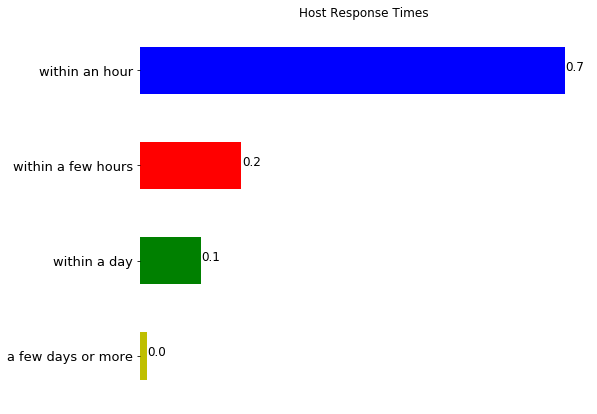


##### Note
We have used Edward Tufte principle and have tried to remove as much chart junk as possible, this simple plot gives the necessary infomration needed for the analysis of the response time.

##### Results
It can be seen that approximately 70% of the hosts in metro vancouver respond with in an hour

ref: https://stackoverflow.com/questions/925024/how-can-i-remove-the-top-and-right-axis-in-matplotlib


```python
sns.set(font_scale=1.4)

data_normalizer = mp.colors.Normalize()
color_map = mp.colors.LinearSegmentedColormap(
    "my_map",
    {
        "red": [(0, 1.0, 1.0),
                (1.0, .5, .5)],
        "green": [(0, 0.5, 0.5),
                  (1.0, 0, 0)],
        "blue": [(0, 0.50, 0.5),
                 (1.0, 0, 0)]
    }
)

# ref: https://www.pythonprogramming.in/bar-chart-with-different-color-of-bars.html
# Explore Categorical Feature - neighborhood_group_cleansed

neigh_vals = dfl['neighbourhood_cleansed'].value_counts()
ax2=(neigh_vals/dfl.shape[0]).plot(kind="barh", figsize = (8,7), fontsize = 13, color = color_map(neigh_vals));
plt.title("Neighbourhood  Cleansed");
totals=[]
for i in ax2.patches:
    totals.append(i.get_width())

total = sum(totals)

# set individual bar lables using above list
for i in ax2.patches:
    # get_width pulls left or right; get_y pushes up or down
    ax2.text(i.get_width()+0.0005, i.get_y()+.25, \
            str(round((i.get_width()/total), 2)), fontsize=12,
color='black')

ax2.invert_yaxis()
ax2.set_xticks([])
ax2.spines['right'].set_visible(False)
ax2.spines['bottom'].set_visible(False)
ax2.spines['left'].set_visible(False)
ax2.spines['top'].set_visible(False)
```


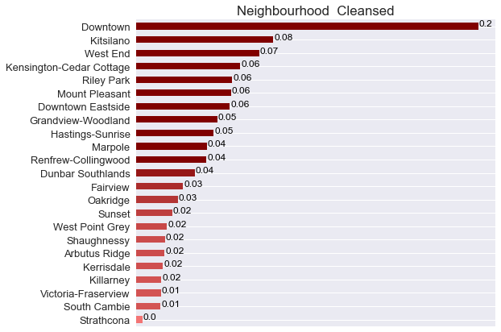


We have used the gradient color in the chart to show the variance in the values.

ref: https://robertmitchellv.com/blog-bar-chart-annotations-pandas-mpl.html

ref: https://www.pythonprogramming.in/bar-chart-with-different-color-of-bars.html


```python
prop_vals = dfl['property_type'].value_counts()
data_normalizer = mp.colors.Normalize()
color_map = mp.colors.LinearSegmentedColormap(
    "my_map",
    {
        
        "green": [(0, 0.25, 0.25),
                  (1.0, 0, 0)],
        "red": [(0, 1.0, 1.0),
                (1.0, .25, .25)],
        "blue": [(0, 0.250, 0.25),
                 (1.0, 0, 0)]
    }
)
ax2=(prop_vals/dfl.shape[0]).plot(kind="barh", figsize = (8,7), fontsize = 13, color = color_map(prop_vals));
plt.title("Property Type");
totals=[]
for i in ax2.patches:
    totals.append(i.get_width())

total = sum(totals)

# set individual bar lables using above list
for i in ax2.patches:
    # get_width pulls left or right; get_y pushes up or down
    ax2.text(i.get_width()+0.0005, i.get_y()+.25, \
            str(round((i.get_width()/total), 2)), fontsize=12,
color='black')

ax2.invert_yaxis()
ax2.set_xticks([])
ax2.spines['right'].set_visible(False)
ax2.spines['bottom'].set_visible(False)
ax2.spines['left'].set_visible(False)
ax2.spines['top'].set_visible(False)
```


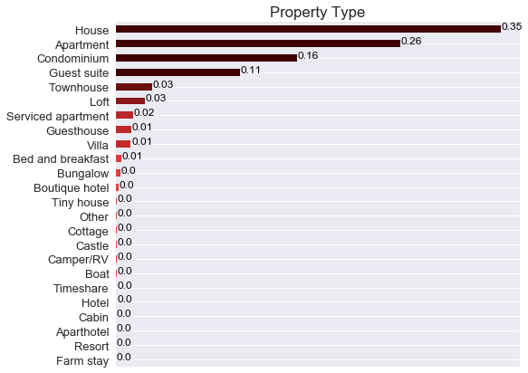


##### Results

Approximately 35% of the properties listed on Vancouver Air bnb are houses and 26% are apartments

### Question 1 - Price correlations
1. Understand the correlation between price and the season of the year, and detect the peak season in Vancouver
2. To get an understanding of price correlation with the neighbourhoods in vancouver
3. Getting an insight into the relationship between the listed pricing and the property type in metro vancovuer


```python
dfc['year'] = pd.DatetimeIndex(dfc['date']).year
dfc['month'] = pd.DatetimeIndex(dfc['date']).month
```

We will remove the $ symbol 

ref:https://stackoverflow.com/questions/22588316/pandas-applying-regex-to-replace-values


```python

dfc['price'] = dfc['price'].replace('[\$,]', '', regex=True).astype(float)
m2=dfc.groupby(['year','month'])[['price']].mean()
ax3=m2.plot(kind="barh", figsize = (8,7), fontsize = 13, color = ['b', 'r', 'g', 'y']);
plt.title("Average price per motnth");

ax3.invert_yaxis()
ax3.legend().set_visible(False)
ax3.spines['right'].set_visible(False)
ax3.spines['bottom'].set_visible(False)
ax3.spines['left'].set_visible(False)
ax3.spines['top'].set_visible(False)
```


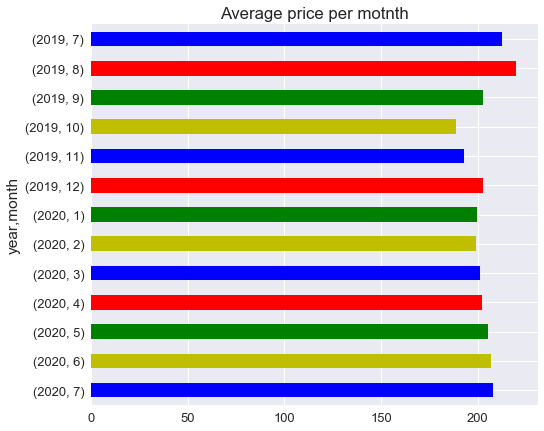


```python
dfl['price'] = dfl['price'].replace('[\$,]', '', regex=True).astype(float)
m2=dfl.groupby(['number_of_reviews'])[['price']].mean()
ax3=m2.plot( figsize = (8,7), fontsize = 13, label = 'price in $');
plt.title("Average price correlation with number of reviews");

#ax3.invert_yaxis()
ax3.legend(loc='upper left')
ax3.spines['right'].set_visible(False)
ax3.spines['bottom'].set_visible(False)
ax3.spines['left'].set_visible(False)
ax3.spines['top'].set_visible(False)
```


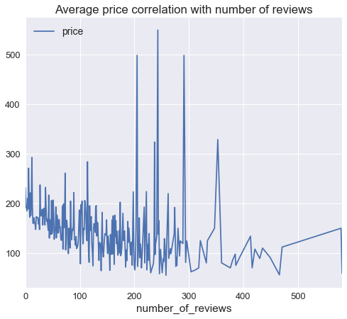


##### Results

As we can see that listing price is higher for the number of reviews between 200-300, as the number of reviews increase we can see that price drops, which suggests that more customer tend to review places which are economical, however places with 200-300 tend to have higher listing price. 

Now we look at the neighbourhood and their pricings


```python
# sorting by price
print(dfl.groupby(['neighbourhood_cleansed'])[['price']].mean().sort_values(by='price',ascending=False))
dfl.groupby(['neighbourhood_cleansed'])[['price']].mean().plot(figsize = (8,7), fontsize = 12, color = 'red');
```

                                   price
    neighbourhood_cleansed              
    Downtown                  244.745082
    West Point Grey           244.324324
    Shaughnessy               228.576923
    West End                  227.586364
    Kerrisdale                216.092784
    Kitsilano                 200.404082
    Downtown Eastside         194.371257
    Dunbar Southlands         194.176190
    Arbutus Ridge             192.009709
    South Cambie              168.306818
    Fairview                  167.428571
    Mount Pleasant            165.088496
    Marpole                   161.474308
    Sunset                    158.623077
    Riley Park                152.131195
    Kensington-Cedar Cottage  146.948925
    Grandview-Woodland        145.027586
    Oakridge                  143.853333
    Strathcona                140.583333
    Victoria-Fraserview       124.764045
    Hastings-Sunrise          123.729242
    Renfrew-Collingwood       122.448413
    Killarney                 121.131868
    


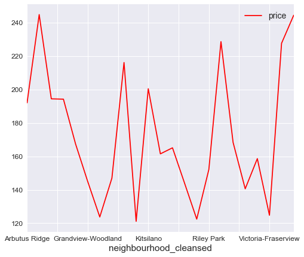


```python
#Top prices 
mean = dfl['price'].mean()
top=dfl.groupby(['neighbourhood_cleansed'])[['price']].mean().sort_values(by = 'price', ascending = False).head();
top.plot(kind = 'bar', figsize = (8,7), fontsize = 13, color = color_map(dfl['price']))
plt.title("Top priced neighbourhoods in Metro Vancouver");
```


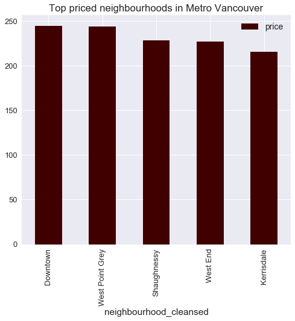


```python
# Now we can also look at the cheapest neighbourhoods in vancouver
mean = dfl['price'].mean()
bot=dfl.groupby(['neighbourhood_cleansed'])[['price']].mean().sort_values(by = 'price', ascending = False).tail();
bot.plot(kind = 'bar', figsize = (8,7), fontsize = 13, color = color_map(dfl['price']))
plt.title("Lowest priced neighbourhoods in Metro Vancouver");
```


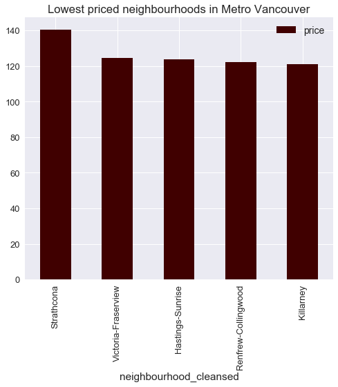


```python

```

##### Resutls
It can be seen from the charts above that the highest average price listed per night is $250 and cheapest is $120 per night in metro Vancouver.


```python
# Explore property types within neighborhoods and how they impact price
# Look at the top neighbourhoods and top property types

neigh = ('Downtown','Westpoint Grey','Shaughnessy','West End','Kerrisdale')
prop = ('Apartment','House')
dfl1 = dfl.loc[dfl['neighbourhood_cleansed'].isin(neigh)]
dfl2 = dfl1.loc[dfl['property_type'].isin(prop)]

dfnp = dfl2.groupby(['neighbourhood_cleansed','property_type'])[['price']].mean().reset_index()
dfnp
```


<div>
<table border="1" class="dataframe">
  <thead>
    <tr style="text-align: right;">
      <th></th>
      <th>neighbourhood_cleansed</th>
      <th>property_type</th>
      <th>price</th>
    </tr>
  </thead>
  <tbody>
    <tr>
      <th>0</th>
      <td>Downtown</td>
      <td>Apartment</td>
      <td>250.253571</td>
    </tr>
    <tr>
      <th>1</th>
      <td>Downtown</td>
      <td>House</td>
      <td>416.000000</td>
    </tr>
    <tr>
      <th>2</th>
      <td>Kerrisdale</td>
      <td>Apartment</td>
      <td>203.363636</td>
    </tr>
    <tr>
      <th>3</th>
      <td>Kerrisdale</td>
      <td>House</td>
      <td>274.840000</td>
    </tr>
    <tr>
      <th>4</th>
      <td>Shaughnessy</td>
      <td>Apartment</td>
      <td>167.000000</td>
    </tr>
    <tr>
      <th>5</th>
      <td>Shaughnessy</td>
      <td>House</td>
      <td>296.540000</td>
    </tr>
    <tr>
      <th>6</th>
      <td>West End</td>
      <td>Apartment</td>
      <td>183.669065</td>
    </tr>
    <tr>
      <th>7</th>
      <td>West End</td>
      <td>House</td>
      <td>250.947368</td>
    </tr>
  </tbody>
</table>
</div>


```python

```


```python
price_arr = dfnp['price'].values
price_arr = np.reshape(price_arr, (4,2))
price_arr.shape
```


    (4, 2)


```python

idx = ['Downtown','Westpoint Grey','Shaughnessy','West End']
cols = ['Apartment', 'House']
df = pd.DataFrame(price_arr, index=idx, columns=cols)

# _r reverses the normal order of the color map 'RdYlGn'
sns.heatmap(df, cmap='spring_r', linewidths=0.5, annot=True);
```


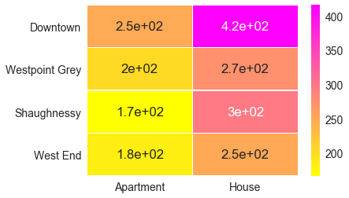


##### Results
It can be seen from the heatmap above that Houses in downtown Vancouver area have higher listing price than apartments. 

ref: https://matplotlib.org/3.1.0/tutorials/colors/colormaps.html

### Question 02 - Review correlation

- Understanding how reviews impact the occupancy rate
- Get a correlation of the reviews with the neighbourhoods in vancouver
- Can we explore some of the worst reviews for additional insights?

let us look at the data in the review and listing table and also calcualte the occupancy rate from the listing can calendar table


```python
# we will now find the occupancy rate
dfo = pd.DataFrame(pd.pivot_table(dfc.groupby(['listing_id', 'available']).count()['date'].reset_index(),index=["listing_id"], columns='available', values='date').reset_index(), columns=['listing_id', 'f', 't']).fillna(0)
# Rename the column
dfo.columns = ['listing_id', 'occupied', 'available']

# finding the occupancy rate which is percentage
dfo['percentage'] = dfo['occupied'] / (dfo['available'] + dfo['occupied'])


# Now remove the unnecessary columns
dfo.drop(['available', 'occupied'], axis=1, inplace=True)
dfo.head()
```


<div>
<table border="1" class="dataframe">
  <thead>
    <tr style="text-align: right;">
      <th></th>
      <th>listing_id</th>
      <th>percentage</th>
    </tr>
  </thead>
  <tbody>
    <tr>
      <th>0</th>
      <td>10080</td>
      <td>0.136986</td>
    </tr>
    <tr>
      <th>1</th>
      <td>13188</td>
      <td>0.284932</td>
    </tr>
    <tr>
      <th>2</th>
      <td>13357</td>
      <td>0.142466</td>
    </tr>
    <tr>
      <th>3</th>
      <td>13490</td>
      <td>0.172603</td>
    </tr>
    <tr>
      <th>4</th>
      <td>14267</td>
      <td>1.000000</td>
    </tr>
  </tbody>
</table>
</div>


Now that we have found the occupancy rate, we can see the correlation of the review scores with the occupancy rate. For that first we merge the listings data and the calendar data. 


```python

data = dfl.merge(dfo, left_on='id', right_on='listing_id', how='inner')
```

Now we drop all the columns with 1 value

Review Score rating vs  Occupancy rate


```python
plt.scatter(data['review_scores_rating'], data['percentage'], color = 'green', marker = 'D')
plt.title('Review score rating and occupancy rate correlation')
plt.xlabel('Review score rating')
plt.ylabel('Occupancy rate')
```


    Text(0,0.5,'Occupancy rate')


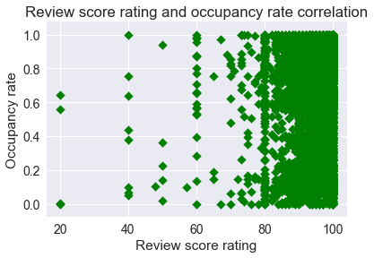


```python
f, axs = plt.subplots(7,figsize=(5,35))
axs[0].scatter(data['review_scores_rating'], data['percentage'], color = 'green', marker = 'D')
axs[1].scatter(data['review_scores_accuracy'], data['percentage'], color = 'blue', marker = 'o')
axs[2].scatter(data['review_scores_cleanliness'], data['percentage'], color = 'red', marker = '2')
axs[3].scatter(data['review_scores_location'], data['percentage'], color = 'black', marker = 'v')
axs[4].scatter(data['review_scores_communication'], data['percentage'], color = 'blue', marker = 'o')
axs[5].scatter(data['review_scores_checkin'], data['percentage'], color = 'red', marker = '2')
axs[6].scatter(data['review_scores_value'], data['percentage'], color = 'black', marker = 'v')

axs[0].set_title('Review scores rating corrleation with occupany rate')
axs[1].set_title('Review score accuracy corrleation with occupany rate')
axs[2].set_title('Review score cleanliness corrleation with occupany rate')
axs[3].set_title('Review score location corrleation with occupany rate')
axs[4].set_title('Review score communication corrleation with occupany rate')
axs[5].set_title('Review score checkin corrleation with occupany rate')
axs[6].set_title('Review score value corrleation with occupany rate')

axs[0].set_ylabel('occupancy rate')
axs[1].set_ylabel('occupancy rate')
axs[2].set_ylabel('occupancy rate')
axs[3].set_ylabel('occupancy rate')
axs[4].set_ylabel('occupancy rate')
axs[5].set_ylabel('occupancy rate')
axs[6].set_ylabel('occupancy rate')


```


    Text(0,0.5,'occupancy rate')


##### Results
Review rates are higher for properties with high occupancy rate. This could be either bad review or good review

ref: https://matplotlib.org/3.1.1/api/_as_gen/matplotlib.pyplot.subplots.html


```python
dfcom = dfr[['listing_id', 'comments']].copy()
dfcom.head()
```


<div>
<table border="1" class="dataframe">
  <thead>
    <tr style="text-align: right;">
      <th></th>
      <th>listing_id</th>
      <th>comments</th>
    </tr>
  </thead>
  <tbody>
    <tr>
      <th>0</th>
      <td>10080</td>
      <td>this accommodation was excellent. beautiful sp...</td>
    </tr>
    <tr>
      <th>1</th>
      <td>10080</td>
      <td>The host canceled my reservation 13 days befor...</td>
    </tr>
    <tr>
      <th>2</th>
      <td>10080</td>
      <td>This apartment is fantastic, just what I and m...</td>
    </tr>
    <tr>
      <th>3</th>
      <td>10080</td>
      <td>Very nice apartment and great view. Close to S...</td>
    </tr>
    <tr>
      <th>4</th>
      <td>10080</td>
      <td>Both Rami and Mauricio made our family of 5 fe...</td>
    </tr>
  </tbody>
</table>
</div>


```python
data2 = dfcom.merge(dfl, left_on='listing_id', right_on='id', how='inner')

```

Now we do the sentiment analysis, using the sentimentintensityanalyzer from NLTK library


```python
import nltk
from nltk.sentiment.vader import SentimentIntensityAnalyzer
anlzer = SentimentIntensityAnalyzer()

def sentiment_analyzer_scores(comm):
    '''
    Function runs sentiment analyzer on the provided comments and returns the total polarity score
    INPUT:
    comm - the text of the review comments 
    OUTPUT:
    result['compound'] - The combinition of positive, negative, and neutral score for a particular sentence for sentiment analysis. 
   
    '''
    comm = str(comm)
    result = anlzer.polarity_scores(comm)
    return result['compound']

data2['polarity_score'] = data2['comments'].apply(sentiment_analyzer_scores)
data2.head()

```


<div>
<table border="1" class="dataframe">
  <thead>
    <tr style="text-align: right;">
      <th></th>
      <th>listing_id</th>
      <th>comments</th>
      <th>id</th>
      <th>listing_url</th>
      <th>scrape_id</th>
      <th>last_scraped</th>
      <th>name</th>
      <th>summary</th>
      <th>space</th>
      <th>description</th>
      <th>...</th>
      <th>is_business_travel_ready</th>
      <th>cancellation_policy</th>
      <th>require_guest_profile_picture</th>
      <th>require_guest_phone_verification</th>
      <th>calculated_host_listings_count</th>
      <th>calculated_host_listings_count_entire_homes</th>
      <th>calculated_host_listings_count_private_rooms</th>
      <th>calculated_host_listings_count_shared_rooms</th>
      <th>reviews_per_month</th>
      <th>polarity_score</th>
    </tr>
  </thead>
  <tbody>
    <tr>
      <th>0</th>
      <td>10080</td>
      <td>this accommodation was excellent. beautiful sp...</td>
      <td>10080</td>
      <td>https://www.airbnb.com/rooms/10080</td>
      <td>20190710134459</td>
      <td>2019-07-10</td>
      <td>D1 -  Million Dollar View 2 BR</td>
      <td>Stunning two bedroom, two bathroom apartment. ...</td>
      <td>Bed setup: 2 x queen, option to add up to 2 tw...</td>
      <td>Stunning two bedroom, two bathroom apartment. ...</td>
      <td>...</td>
      <td>f</td>
      <td>strict_14_with_grace_period</td>
      <td>f</td>
      <td>f</td>
      <td>36</td>
      <td>36</td>
      <td>0</td>
      <td>0</td>
      <td>0.17</td>
      <td>0.9824</td>
    </tr>
    <tr>
      <th>1</th>
      <td>10080</td>
      <td>The host canceled my reservation 13 days befor...</td>
      <td>10080</td>
      <td>https://www.airbnb.com/rooms/10080</td>
      <td>20190710134459</td>
      <td>2019-07-10</td>
      <td>D1 -  Million Dollar View 2 BR</td>
      <td>Stunning two bedroom, two bathroom apartment. ...</td>
      <td>Bed setup: 2 x queen, option to add up to 2 tw...</td>
      <td>Stunning two bedroom, two bathroom apartment. ...</td>
      <td>...</td>
      <td>f</td>
      <td>strict_14_with_grace_period</td>
      <td>f</td>
      <td>f</td>
      <td>36</td>
      <td>36</td>
      <td>0</td>
      <td>0</td>
      <td>0.17</td>
      <td>0.0000</td>
    </tr>
    <tr>
      <th>2</th>
      <td>10080</td>
      <td>This apartment is fantastic, just what I and m...</td>
      <td>10080</td>
      <td>https://www.airbnb.com/rooms/10080</td>
      <td>20190710134459</td>
      <td>2019-07-10</td>
      <td>D1 -  Million Dollar View 2 BR</td>
      <td>Stunning two bedroom, two bathroom apartment. ...</td>
      <td>Bed setup: 2 x queen, option to add up to 2 tw...</td>
      <td>Stunning two bedroom, two bathroom apartment. ...</td>
      <td>...</td>
      <td>f</td>
      <td>strict_14_with_grace_period</td>
      <td>f</td>
      <td>f</td>
      <td>36</td>
      <td>36</td>
      <td>0</td>
      <td>0</td>
      <td>0.17</td>
      <td>0.9595</td>
    </tr>
    <tr>
      <th>3</th>
      <td>10080</td>
      <td>Very nice apartment and great view. Close to S...</td>
      <td>10080</td>
      <td>https://www.airbnb.com/rooms/10080</td>
      <td>20190710134459</td>
      <td>2019-07-10</td>
      <td>D1 -  Million Dollar View 2 BR</td>
      <td>Stunning two bedroom, two bathroom apartment. ...</td>
      <td>Bed setup: 2 x queen, option to add up to 2 tw...</td>
      <td>Stunning two bedroom, two bathroom apartment. ...</td>
      <td>...</td>
      <td>f</td>
      <td>strict_14_with_grace_period</td>
      <td>f</td>
      <td>f</td>
      <td>36</td>
      <td>36</td>
      <td>0</td>
      <td>0</td>
      <td>0.17</td>
      <td>0.6997</td>
    </tr>
    <tr>
      <th>4</th>
      <td>10080</td>
      <td>Both Rami and Mauricio made our family of 5 fe...</td>
      <td>10080</td>
      <td>https://www.airbnb.com/rooms/10080</td>
      <td>20190710134459</td>
      <td>2019-07-10</td>
      <td>D1 -  Million Dollar View 2 BR</td>
      <td>Stunning two bedroom, two bathroom apartment. ...</td>
      <td>Bed setup: 2 x queen, option to add up to 2 tw...</td>
      <td>Stunning two bedroom, two bathroom apartment. ...</td>
      <td>...</td>
      <td>f</td>
      <td>strict_14_with_grace_period</td>
      <td>f</td>
      <td>f</td>
      <td>36</td>
      <td>36</td>
      <td>0</td>
      <td>0</td>
      <td>0.17</td>
      <td>0.9694</td>
    </tr>
  </tbody>
</table>
<p>5 rows × 109 columns</p>
</div>


ref:https://stackoverflow.com/questions/39462021/nltk-sentiment-vader-polarity-scorestext-not-working


```python
neigh_polarity = data2.groupby('neighbourhood_cleansed')[['polarity_score']].mean().sort_values(by='polarity_score',ascending=False)
```


```python
top2 = data2.groupby('neighbourhood_cleansed')[['polarity_score']].mean().sort_values(by='polarity_score',ascending=False).head()
bot2 = data2.groupby('neighbourhood_cleansed')[['polarity_score']].mean().sort_values(by='polarity_score',ascending=False).tail()

top2.plot(kind = 'bar', figsize = (8,7), fontsize = 13, color = color_map(data2['polarity_score']))
plt.title("Top reviewed neighbourhoods in Metro Vancouver");
```


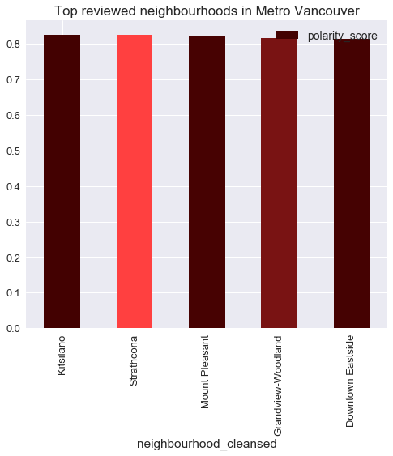


```python
bot2.plot(kind = 'bar', figsize = (8,7), fontsize = 13, color = color_map(data2['polarity_score']))
plt.title("Least reviewed neighbourhoods in Metro Vancouver");
```


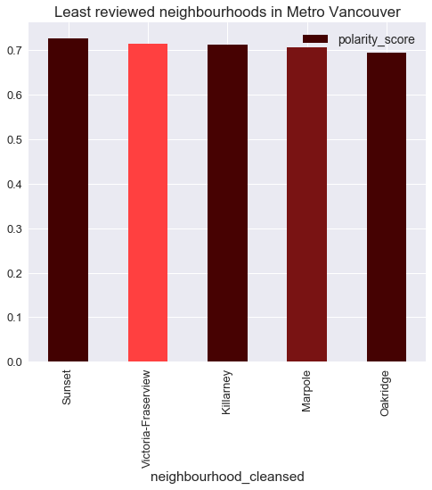


### Question # 03

Now we will look at the influence of parameters such as below on the availability rate 
- Cancellation policy
- Room type
- Number of guests
- Guests picture


First we try to clean the data and deal with the missing values, For bathrooms column, there are two missing values, but a property must have atleast 1 bathroom, so we will use 1 to fill the NA. We will also drop unnecessary columns


```python
dfl2 = data.copy()

dfl2 = dfl2.drop(['id','listing_url','scrape_id','last_scraped','thumbnail_url','medium_url','xl_picture_url','host_id','host_url','host_thumbnail_url','host_verifications','street','neighbourhood','neighbourhood_group_cleansed','zipcode','smart_location','country','experiences_offered','market','jurisdiction_names','latitude','host_acceptance_rate', 'longitude','weekly_price','monthly_price','calendar_updated','calendar_last_scraped','first_review','last_review','calculated_host_listings_count','reviews_per_month', 'square_feet'], axis= 1)
```


```python
dfl2.shape
```


    (5975, 74)


```python
dfl2.isnull().sum()
```


    name                                               0
    summary                                          161
    space                                           1188
    description                                       72
    neighborhood_overview                           1594
    notes                                           2922
    transit                                         1606
    access                                          2064
    interaction                                     1860
    house_rules                                     1552
    picture_url                                        0
    host_name                                          7
    host_since                                         7
    host_location                                     14
    host_about                                      2270
    host_response_time                               532
    host_response_rate                               532
    host_is_superhost                                  7
    host_picture_url                                   7
    host_neighbourhood                               598
    host_listings_count                                7
    host_total_listings_count                          7
    host_has_profile_pic                               7
    host_identity_verified                             7
    neighbourhood_cleansed                             0
    city                                               0
    state                                              3
    country_code                                       0
    is_location_exact                                  0
    property_type                                      0
                                                    ... 
    minimum_maximum_nights                             0
    maximum_maximum_nights                             0
    minimum_nights_avg_ntm                             0
    maximum_nights_avg_ntm                             0
    has_availability                                   0
    availability_30                                    0
    availability_60                                    0
    availability_90                                    0
    availability_365                                   0
    number_of_reviews                                  0
    number_of_reviews_ltm                              0
    review_scores_rating                             914
    review_scores_accuracy                           916
    review_scores_cleanliness                        915
    review_scores_checkin                            919
    review_scores_communication                      916
    review_scores_location                           918
    review_scores_value                              918
    requires_license                                   0
    license                                         1097
    instant_bookable                                   0
    is_business_travel_ready                           0
    cancellation_policy                                0
    require_guest_profile_picture                      0
    require_guest_phone_verification                   0
    calculated_host_listings_count_entire_homes        0
    calculated_host_listings_count_private_rooms       0
    calculated_host_listings_count_shared_rooms        0
    listing_id                                         0
    percentage                                         0
    dtype: int64


```python
dfl3 = dfl2.select_dtypes(include=['float', 'int'])
```


```python
dfl3.isnull().sum()
```


    host_listings_count              7
    host_total_listings_count        7
    bathrooms                        2
    bedrooms                         4
    beds                             5
    price                            0
    minimum_nights_avg_ntm           0
    maximum_nights_avg_ntm           0
    review_scores_rating           914
    review_scores_accuracy         916
    review_scores_cleanliness      915
    review_scores_checkin          919
    review_scores_communication    916
    review_scores_location         918
    review_scores_value            918
    percentage                       0
    dtype: int64


```python
dfl2['bathrooms'] = dfl2['bathrooms'].fillna(1)


dfl2['bedrooms'] = dfl2['bedrooms'].fillna(1)


dfl2['beds'] = dfl2['beds'].fillna(1)
dfl2['host_listings_count'] = dfl2['host_listings_count'].fillna(1)
dfl2['host_total_listings_count'] = dfl2['host_total_listings_count'].fillna(1)

dfl2['review_scores_rating'] = dfl2['review_scores_rating'].fillna(0)

dfl2['review_scores_accuracy'] = dfl2['review_scores_accuracy'].fillna(0)

dfl2['review_scores_cleanliness'] = dfl2['review_scores_cleanliness'].fillna(0)

dfl2['review_scores_checkin'] = dfl2['review_scores_checkin'].fillna(0)

dfl2['review_scores_rating'] = dfl2['review_scores_rating'].fillna(0)
dfl2['review_scores_communication'] = dfl2['review_scores_communication'].fillna(0)
dfl2['review_scores_value'] = dfl2['review_scores_value'].fillna(0)
dfl2['review_scores_location'] = dfl2['review_scores_location'].fillna(0)
```


```python
dfl3 = dfl2.select_dtypes(include=['float', 'int'])
dfl3.isnull().sum()
```


    host_listings_count            0
    host_total_listings_count      0
    bathrooms                      0
    bedrooms                       0
    beds                           0
    price                          0
    minimum_nights_avg_ntm         0
    maximum_nights_avg_ntm         0
    review_scores_rating           0
    review_scores_accuracy         0
    review_scores_cleanliness      0
    review_scores_checkin          0
    review_scores_communication    0
    review_scores_location         0
    review_scores_value            0
    percentage                     0
    dtype: int64


Now none of integer and float  type columns have missing values. 


```python
dfl2.select_dtypes(include=['object']).columns
```


    Index(['name', 'summary', 'space', 'description', 'neighborhood_overview',
           'notes', 'transit', 'access', 'interaction', 'house_rules',
           'picture_url', 'host_name', 'host_since', 'host_location', 'host_about',
           'host_response_time', 'host_response_rate', 'host_is_superhost',
           'host_picture_url', 'host_neighbourhood', 'host_has_profile_pic',
           'host_identity_verified', 'neighbourhood_cleansed', 'city', 'state',
           'country_code', 'is_location_exact', 'property_type', 'room_type',
           'bed_type', 'amenities', 'security_deposit', 'cleaning_fee',
           'extra_people', 'has_availability', 'requires_license', 'license',
           'instant_bookable', 'is_business_travel_ready', 'cancellation_policy',
           'require_guest_profile_picture', 'require_guest_phone_verification'],
          dtype='object')


```python
dfl2['host_response_time'] = dfl2['host_response_time'].fillna('N/A')


dfl2['host_response_rate'] = dfl2['host_response_rate'].apply(lambda x: 0 if x == 'N/A' else x)
dfl2['host_response_rate'] = dfl2['host_response_rate'].replace('[\%,]', '', regex=True).astype(float)
dfl2['host_response_rate'] = dfl2['host_response_rate'].fillna(0)

# Drop record with empty value for property_type
dfl2 = dfl2.dropna(subset=['property_type'], axis=0)

# Removing $ symbol from all the fees
dfl2['security_deposit'] = dfl2['security_deposit'].replace('[\$,]', '', regex=True).astype(float)
dfl2['cleaning_fee'] = dfl2['cleaning_fee'].replace('[\$,]', '', regex=True).astype(float)
dfl2['extra_people'] = dfl2['extra_people'].replace('[\$,]', '', regex=True).astype(float)
dfl2['security_deposit'] = dfl2['security_deposit'].fillna(0)
dfl2['cleaning_fee'] = dfl2['cleaning_fee'].fillna(0)


#making, citites,state lower case for uniformity
dfl2['city'] = dfl2['city'].str.lower()
dfl2['city'] = dfl2['city'].str.strip()
dfl2['state'] = dfl2['state'].str.lower()
```

Now we will make xome box plots to visulaizecorrelation between parameters and the occupancy rate


```python

top = dfl2[['property_type','require_guest_profile_picture', 'guests_included',   'cancellation_policy','room_type', 'percentage']]

```


```python
# Now we are going to make a box plot to see the relationship

boxplot1 = top.boxplot(column= 'percentage', by ='room_type', fontsize = 12, figsize = (8,7), grid = False)
boxplot1.set_xlabel('Room Type')
boxplot1.set_ylabel('Occupancy Rate')

boxplot1.get_figure().gca().set_title(" ")
boxplot1.get_figure().suptitle('Relationship of room type with occupancy rate')
```


    Text(0.5,0.98,'Relationship of room type with occupancy rate')


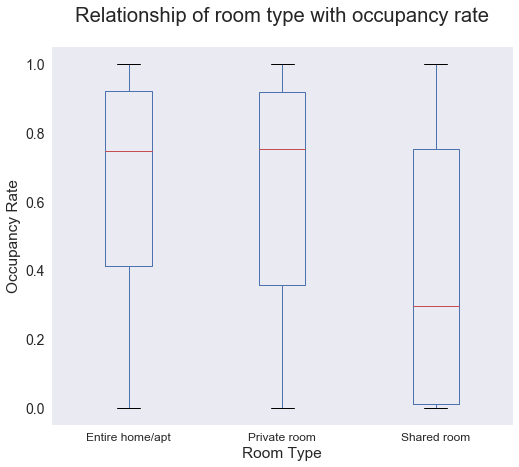


```python
top.groupby(['room_type'])[['percentage']].mean().sort_values(by = 'percentage', ascending = False)
```


<div>
<table border="1" class="dataframe">
  <thead>
    <tr style="text-align: right;">
      <th></th>
      <th>percentage</th>
    </tr>
    <tr>
      <th>room_type</th>
      <th></th>
    </tr>
  </thead>
  <tbody>
    <tr>
      <th>Entire home/apt</th>
      <td>0.650530</td>
    </tr>
    <tr>
      <th>Private room</th>
      <td>0.636747</td>
    </tr>
    <tr>
      <th>Shared room</th>
      <td>0.410218</td>
    </tr>
  </tbody>
</table>
</div>


##### Results
As we can see that entire homes, and private rooms are more popular than shared rooms and have very low availability. This is evident from the calcualted average above. 


```python
boxplot2 = top.boxplot(column= 'percentage', by ='property_type', fontsize = 12, figsize = (8,7), grid = False,  rot=90)
boxplot2.set_xlabel('Property Type')
boxplot2.set_ylabel('Occupancy Rate')

boxplot2.get_figure().gca().set_title(" ")
boxplot2.get_figure().suptitle('Relationship of property type with occupancy rate')
```


    Text(0.5,0.98,'Relationship of property type with occupancy rate')


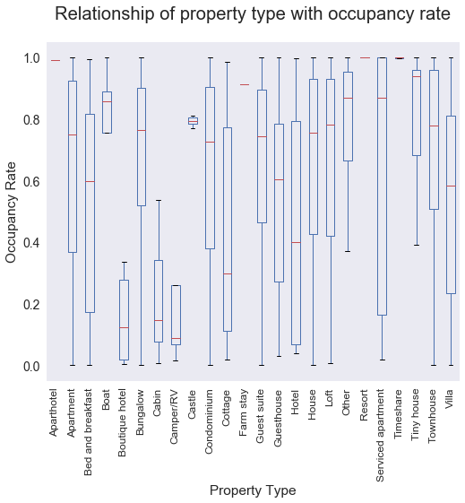


##### Results

Botique hotels are the least occupied property in metro vancouver


```python
top.groupby(['property_type'])[['percentage']].mean().sort_values(by = 'percentage', ascending = False)
```


<div>
<table border="1" class="dataframe">
  <thead>
    <tr style="text-align: right;">
      <th></th>
      <th>percentage</th>
    </tr>
    <tr>
      <th>property_type</th>
      <th></th>
    </tr>
  </thead>
  <tbody>
    <tr>
      <th>Resort</th>
      <td>1.000000</td>
    </tr>
    <tr>
      <th>Timeshare</th>
      <td>0.998630</td>
    </tr>
    <tr>
      <th>Aparthotel</th>
      <td>0.991781</td>
    </tr>
    <tr>
      <th>Farm stay</th>
      <td>0.912329</td>
    </tr>
    <tr>
      <th>Boat</th>
      <td>0.802192</td>
    </tr>
    <tr>
      <th>Castle</th>
      <td>0.792329</td>
    </tr>
    <tr>
      <th>Tiny house</th>
      <td>0.779795</td>
    </tr>
    <tr>
      <th>Other</th>
      <td>0.774658</td>
    </tr>
    <tr>
      <th>Townhouse</th>
      <td>0.699698</td>
    </tr>
    <tr>
      <th>Loft</th>
      <td>0.664340</td>
    </tr>
    <tr>
      <th>Serviced apartment</th>
      <td>0.661554</td>
    </tr>
    <tr>
      <th>Guest suite</th>
      <td>0.659320</td>
    </tr>
    <tr>
      <th>House</th>
      <td>0.656108</td>
    </tr>
    <tr>
      <th>Bungalow</th>
      <td>0.639530</td>
    </tr>
    <tr>
      <th>Apartment</th>
      <td>0.638824</td>
    </tr>
    <tr>
      <th>Condominium</th>
      <td>0.634759</td>
    </tr>
    <tr>
      <th>Guesthouse</th>
      <td>0.548687</td>
    </tr>
    <tr>
      <th>Villa</th>
      <td>0.543201</td>
    </tr>
    <tr>
      <th>Bed and breakfast</th>
      <td>0.528325</td>
    </tr>
    <tr>
      <th>Hotel</th>
      <td>0.459589</td>
    </tr>
    <tr>
      <th>Cottage</th>
      <td>0.430594</td>
    </tr>
    <tr>
      <th>Camper/RV</th>
      <td>0.269589</td>
    </tr>
    <tr>
      <th>Cabin</th>
      <td>0.231050</td>
    </tr>
    <tr>
      <th>Boutique hotel</th>
      <td>0.189555</td>
    </tr>
  </tbody>
</table>
</div>


```python
boxplot3 = top.boxplot(column= 'percentage', by ='cancellation_policy', fontsize = 12, figsize = (8,7), grid = False,  rot=90)
boxplot3.set_xlabel('Cancellation Policy')
boxplot3.set_ylabel('Occupancy Rate')

boxplot3.get_figure().gca().set_title(" ")
boxplot3.get_figure().suptitle('Relationship of cancellation policy with occupancy rate')
```


    Text(0.5,0.98,'Relationship of cancellation policy with occupancy rate')


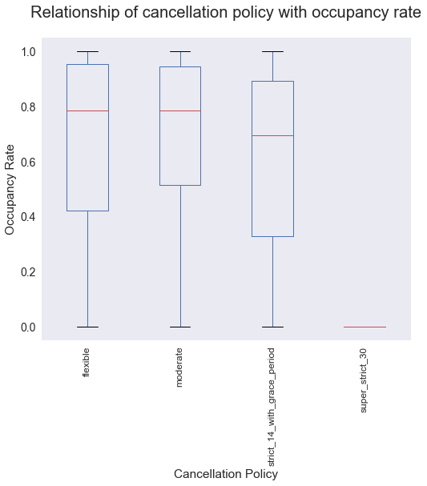


```python
top.groupby(['cancellation_policy'])[['percentage']].mean().sort_values(by = 'percentage', ascending = False)
```


<div>
<table border="1" class="dataframe">
  <thead>
    <tr style="text-align: right;">
      <th></th>
      <th>percentage</th>
    </tr>
    <tr>
      <th>cancellation_policy</th>
      <th></th>
    </tr>
  </thead>
  <tbody>
    <tr>
      <th>moderate</th>
      <td>0.695356</td>
    </tr>
    <tr>
      <th>flexible</th>
      <td>0.666213</td>
    </tr>
    <tr>
      <th>strict_14_with_grace_period</th>
      <td>0.614464</td>
    </tr>
    <tr>
      <th>super_strict_30</th>
      <td>0.000000</td>
    </tr>
  </tbody>
</table>
</div>


##### Results

Above results suggest that, properties with more moderate to flexible cancellation policy tend to have more demand and higher occupancy, whereas properties with more strict cancellation policy have more availability. This suggests that for higher profits, businesses should move towards more relaxed cancellation policy


```python
boxplot4 = top.boxplot(column= 'percentage', by ='guests_included', fontsize = 12, figsize = (8,7), grid = False)
boxplot4.set_xlabel('Number of guests')
boxplot4.set_ylabel('Occupancy Rate')

boxplot4.get_figure().gca().set_title(" ")
boxplot4.get_figure().suptitle('Relationship of number of guests with occupancy rate')
```


    Text(0.5,0.98,'Relationship of number of guests with occupancy rate')


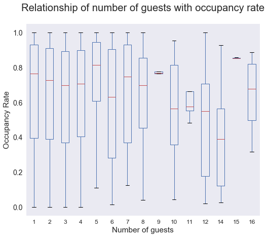


```python
top.groupby(['guests_included'])[['percentage']].mean().sort_values(by = 'percentage', ascending = False)
```


<div>
<table border="1" class="dataframe">
  <thead>
    <tr style="text-align: right;">
      <th></th>
      <th>percentage</th>
    </tr>
    <tr>
      <th>guests_included</th>
      <th></th>
    </tr>
  </thead>
  <tbody>
    <tr>
      <th>15</th>
      <td>0.860665</td>
    </tr>
    <tr>
      <th>5</th>
      <td>0.708476</td>
    </tr>
    <tr>
      <th>9</th>
      <td>0.705205</td>
    </tr>
    <tr>
      <th>1</th>
      <td>0.653536</td>
    </tr>
    <tr>
      <th>7</th>
      <td>0.651689</td>
    </tr>
    <tr>
      <th>11</th>
      <td>0.639726</td>
    </tr>
    <tr>
      <th>16</th>
      <td>0.639726</td>
    </tr>
    <tr>
      <th>2</th>
      <td>0.638048</td>
    </tr>
    <tr>
      <th>4</th>
      <td>0.635192</td>
    </tr>
    <tr>
      <th>8</th>
      <td>0.634219</td>
    </tr>
    <tr>
      <th>3</th>
      <td>0.623868</td>
    </tr>
    <tr>
      <th>6</th>
      <td>0.605355</td>
    </tr>
    <tr>
      <th>10</th>
      <td>0.539155</td>
    </tr>
    <tr>
      <th>12</th>
      <td>0.468493</td>
    </tr>
    <tr>
      <th>14</th>
      <td>0.387476</td>
    </tr>
  </tbody>
</table>
</div>


##### Results

Listings which can host from families upto a small group are high in demand


```python
boxplot5 = top.boxplot(column= 'percentage', by ='require_guest_profile_picture', fontsize = 12, figsize = (8,7), grid = False)
boxplot5.set_xlabel('Require guest profile photo')
boxplot5.set_ylabel('Occupancy Rate')

boxplot5.get_figure().gca().set_title(" ")
boxplot5.get_figure().suptitle('Relationship of guest profile photo with occupancy rate')
```


    Text(0.5,0.98,'Relationship of guest profile photo with occupancy rate')


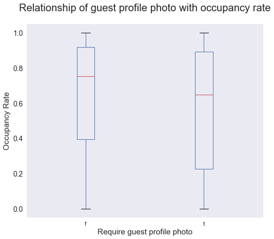


```python
top.groupby(['require_guest_profile_picture'])[['percentage']].mean().sort_values(by = 'percentage', ascending = False)
```


<div>
<table border="1" class="dataframe">
  <thead>
    <tr style="text-align: right;">
      <th></th>
      <th>percentage</th>
    </tr>
    <tr>
      <th>require_guest_profile_picture</th>
      <th></th>
    </tr>
  </thead>
  <tbody>
    <tr>
      <th>f</th>
      <td>0.646238</td>
    </tr>
    <tr>
      <th>t</th>
      <td>0.560999</td>
    </tr>
  </tbody>
</table>
</div>


##### Results
Properties that donot require guests profile photo for booking  has low availability and are more popular


```python

```
